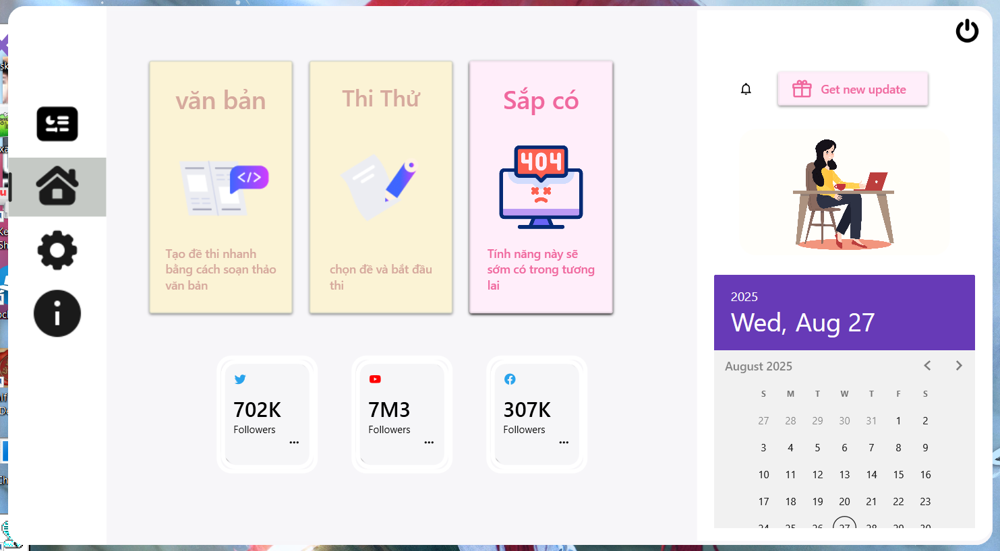
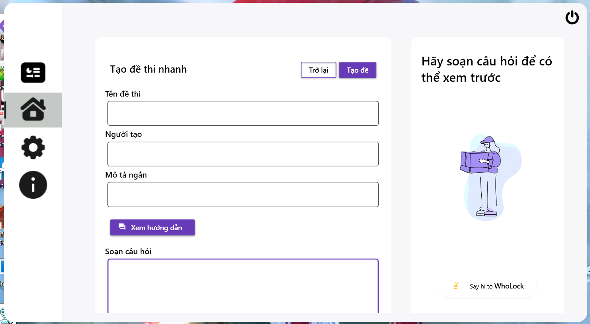
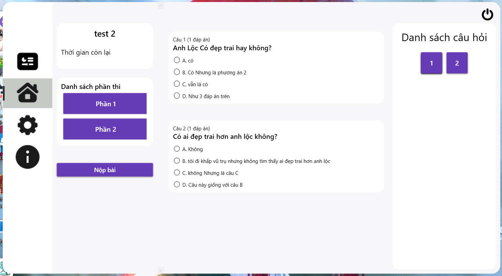
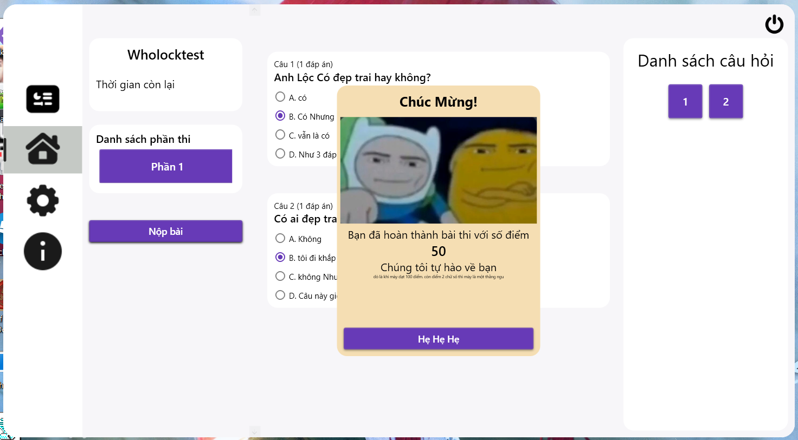

## Project Multiple Choice

đây là một dự án nhỏ về chủ đề tạo đề thi trắc nhiệm. tôi làm ứng dụng này bởi vì mấy ứng dụng khác có tính năng tương tự ngoài kia nó tính **phí**
hiện tại ứng dụng đang trong quá trình phát triển và còn một số tính năng chưa ra mắt. tôi sẽ làm nó vào tương lai (**đó là khi tôi rảnh**)

  
  
  
  

**Lưu ý** 
 khi tạo đề thi nó sẽ được tạo vào folder Exam với đuôi .json chỉ cần bỏ file đề thi .json đã tạo vào thì phần mềm tự động nhận diện và load vào danh sách đề thi.
